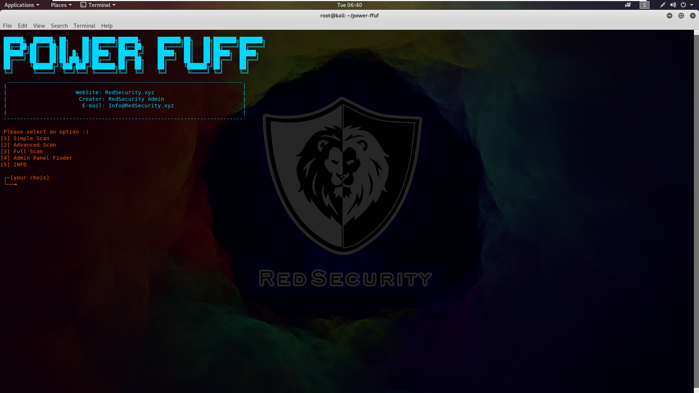

# power-ffuf
Power FFUF is Very Fast and Powerful Web Fuzzer<br/>Power FFUF uses ffuf and hakrawler to scan<br/>Power FFUF is in some cases better and easier than ffuf, although it does not have some of the options of ffuf
## installation
1. Install Golang
2. Run the command below
```
bash installer.sh
```
## Usage
Just run the following command in the power-ffuf directory
```
./power-ffuf
```
OR
```
bash power-ffuf
```
## ScreenShot

## Contact us
WebSite: redsecurity.xyz<br/>Email: info@redsecurity.xyz
